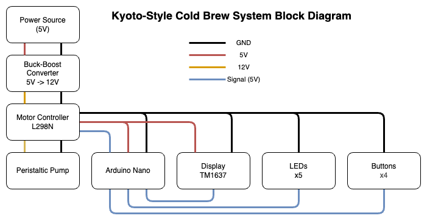
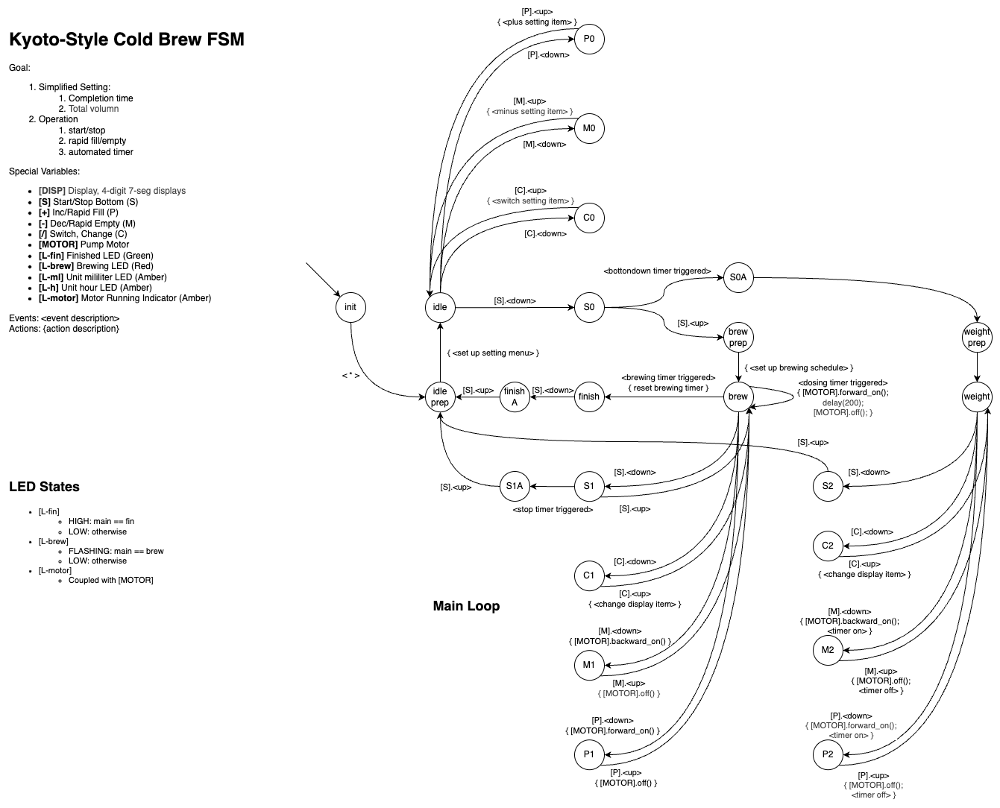

# Precision Cold Drip Coffee Maker

Alternative Interpretation of Kyoto-Style Cold Brew.

Name the coffee maker as Precision Cold Drip (still looking for better name).

## Bill of Material

### 3D-Printed Parts

The project file (.3mf) for [PrusaSlicer](https://www.prusa3d.com/page/prusaslicer_424/) are provided.

- Cold brew machine: [KSCB-3DModel/KSCB-PrusaSlicer.3mf](KSCB-3DModel/KSCB-PrusaSlicer.3mf)
- Cold brew machine case: [KSCB-3DModel/KSCB-Case-PrusaSlicer.3mf](KSCB-3DModel/KSCB-Case-PrusaSlicer.3mf)
- [Optional] STEP file for blank front place for modification: [KSCB-3DModel/BlankFrontPlate.step](KSCB-3DModel/BlankFrontPlate.step)

### Pruchased Parts

Note: in case the exact components cannot be sourced, a [STEP file](KSCB-3DModel/BlankFrontPlate.step) of blank front plate is provided for modification in `KSCB-3DModel` folder.

- **Buck-Boost Converter** (x1)
  - Any boost converter that convert 5V to 12V works. The current requirement is 1A at 12V, but regular operating amperage should never exceed that.
- **Motor Controller** (x1)
  - L298N should suffice. Other equivalent should also work.
  - PWM capability is not required. I found the PWM is not reliable enough and often stall the peristaltic pump. So, short pulsing is more consistent than continuous dripping using PWM.
  - The 5V power supply is not necessary either. If the voltage of the main power source is stable (this is often true from power bank), it can directly power the microcontroller and other 5V devices.
- **7 Segmented Display** (x1)
  - TM1637 powered module would be the best.
- **Button** (x4)
  - Any normally open momentary switch would work here.
  - The model is based on 7mm panel mount buttons.
- **LED** and **Resistor** (x5)
  - The most basic LED will work here.
  - The resistor is for current limiting. The resistance ranging from 200 ohm to 400 ohm would work. 
- **Arduino Nano** (x1)
  - Any microcontroller would work here with pinout modification. The libraries in the code are based on Arduino Framework, and written with PlatformIO extension in VSCode.
  - The code is based on Arduino Nano, and would work without any modification.
- **Peristaltic Pump** (x1)
  - A 12V small peristaltic pump with tube size 3mm ID x 5mm OD would work here. The link to the purchase page is likely to expire in the future, so source the similar item. The picture of the pump used in this build is [here](Others/PumpScreenshot.png). 

## Pump Pulse Flow Rate Calibration Data

function of best fit: 

$$R(t) = 0.000513 e^{-0.009825t} + 0.001392$$

- $t$ is the duration of pulse in milliseconds
- $R$ is the pump flow rate in grams per millisecond

The flow rate is calculated with supply voltage of 12V to L298N module. The voltage received by pump motor is around 10V according to L298N datasheet (voltage drop is around 2V).

See more detail in [KSCB-PumpCalibrationData/PumpTesting.ipynb](KSCB-PumpCalibrationData/PumpTesting.ipynb).

## System Reference Diagram

### Block Diagram

### System Finite State Machine

## TODO

- [x] Bill of Material
- [ ] Building Guide
- [x] Model parts
- [ ] Circuit Diagram / Schematics
- [x] Calibration code/data
- [x] Control Code
- [ ] User Manual

## Credit

**Zihui(Andy) Liu** ([Personal Website](https://nightingale-lzh.github.io), [GitHub](<https://github.com/Nightingale-LZH>))

This project is published under GNU General Public License version 3 (GPLv3) which allows users to run, modify, and distribute software while ensuring that any modified versions remain open source. This project is funded by creator's love to coffee.
